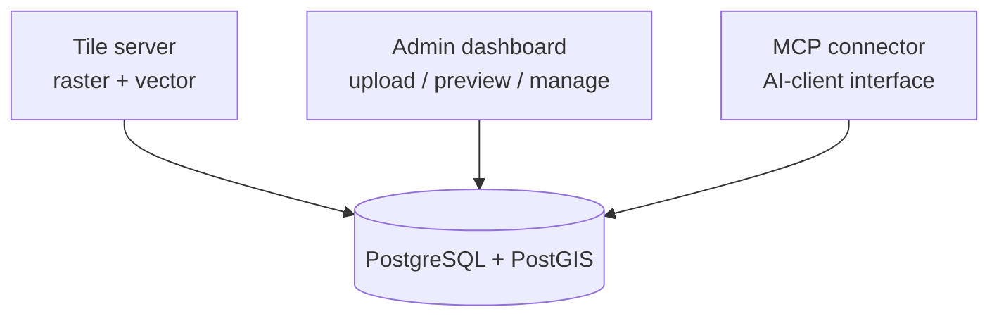
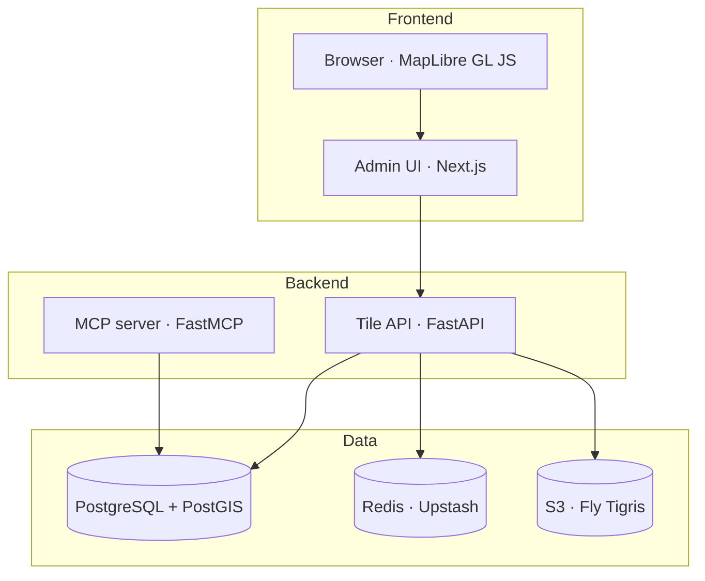
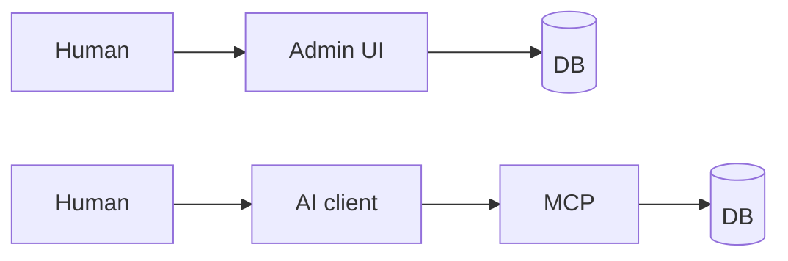

# FOSS4G 2026 Hiroshima 発表準備実装計画

> **For agentic workers:** このプランは執筆・撮影・リハーサルが中心で、コードはほぼ無い。各タスクは「成果物 1 つ」を生む粒度で切ってある。チェックボックスで進捗管理。

**Goal:** 2026-09-02 17:30 の FOSS4G 2026 Hiroshima 20 分発表を、英語スライド 14 枚 + 2 分以内のデモ録画 + 2 回のリハーサル完了状態まで仕上げる。

**Architecture:** Spec (`docs/specs/2026-06-16-foss4g-2026-presentation-design.md`) で確定済みの 14 枚構成・タイミング・ナラティブ方針に従い、(1) コンテンツ執筆、(2) ビジュアル制作、(3) デモ録画、(4) デッキ統合、(5) リハーサル&仕上げ の順で進める。

**Tech Stack:** Marp (Markdown + CSS) または Keynote / Google Slides（Task 1 で確定）、OBS Studio または macOS QuickTime（録画）、ffmpeg（字幕焼き込み）、Mermaid または draw.io（ダイアグラム）

**Parent spec:** [`docs/specs/2026-06-16-foss4g-2026-presentation-design.md`](../specs/2026-06-16-foss4g-2026-presentation-design.md)

**作業ディレクトリ:** すべての成果物は `docs/foss4g-2026/` 配下に置く（このプランで作成）

---

## Task 1: 作業ディレクトリと意思決定ログを作る

**Files:**
- Create: `docs/foss4g-2026/README.md`
- Create: `docs/foss4g-2026/decisions.md`

- [ ] **Step 1: ディレクトリと README を作る**

`docs/foss4g-2026/README.md` の内容:

```markdown
# FOSS4G 2026 Hiroshima — 発表ワーキングディレクトリ

- Spec: `../specs/2026-06-16-foss4g-2026-presentation-design.md`
- Plan: `../plans/2026-06-16-foss4g-2026-presentation.md`

## 構成

- `slides/` — スライド原稿（slide-01.md 〜 slide-14.md）
- `speaker-notes/` — 各スライドの英語スピーカーノート
- `assets/` — 図版・スクリーンショット・地図画像
- `demo/` — デモ用データ、撮影台本、最終 MP4
- `qa/` — 想定問答リスト
- `decisions.md` — 意思決定ログ（ツール選定など）
```

- [ ] **Step 2: decisions.md を作る（空テンプレート）**

`docs/foss4g-2026/decisions.md`:

```markdown
# 意思決定ログ

| 日付 | 決定事項 | 内容 | 理由 |
|---|---|---|---|
```

- [ ] **Step 3: 各サブディレクトリを作成**

```bash
mkdir -p docs/foss4g-2026/{slides,speaker-notes,assets,demo,qa}
touch docs/foss4g-2026/slides/.gitkeep
touch docs/foss4g-2026/speaker-notes/.gitkeep
touch docs/foss4g-2026/assets/.gitkeep
touch docs/foss4g-2026/demo/.gitkeep
touch docs/foss4g-2026/qa/.gitkeep
```

- [ ] **Step 4: Commit**

```bash
git add docs/foss4g-2026/
git commit -m "docs(foss4g-2026): scaffold working directory"
```

---

## Task 2: スライドツールを決定する

**Files:**
- Modify: `docs/foss4g-2026/decisions.md`

- [ ] **Step 1: 3 候補を評価する**

評価軸（10 点満点で見積もる、決定の根拠としてログ）:

- **Marp**: 再現性 ◎ / 共同編集 △ / 動画埋め込み △（PDF にはならない、HTML/PPTX 経由）/ 学習コスト 低
- **Keynote**: 投影安定性 ◎ / 動画埋め込み ◎ / 共同編集 ×（Mac 限定）/ バージョン管理 ×
- **Google Slides**: 共同編集 ◎ / どこからでもアクセス可 ◎ / 動画埋め込み ○（YouTube/Drive 経由）/ オフライン投影リスク

- [ ] **Step 2: 決定理由を decisions.md に追記**

```markdown
| 2026-06-XX | スライドツール | <選択肢> | <理由> |
```

決定基準: (a) 投影トラブル耐性、(b) 動画埋め込みの安定性、(c) 発表者個人の習熟度。迷ったら Keynote（投影と動画再生が最も安定）。

- [ ] **Step 3: Commit**

```bash
git add docs/foss4g-2026/decisions.md
git commit -m "docs(foss4g-2026): decide slide tool"
```

---

## Task 3: 広島オープンデータ（避難所）を選定しライセンス確認する

**Files:**
- Create: `docs/foss4g-2026/demo/dataset.md`
- Create: `docs/foss4g-2026/demo/source.geojson`（または `.csv`）

- [ ] **Step 1: 候補データセットを 2〜3 確認する**

候補:

- 広島市オープンデータカタログサイト (https://www.city.hiroshima.lg.jp/) 配下の「指定避難所一覧」「避難場所一覧」
- 広島県オープンデータポータル配下の防災関連ポイント

確認項目: 形式（CSV/GeoJSON/Shapefile）、座標系、ライセンス（CC-BY / 政府標準利用規約 等）、更新日。

- [ ] **Step 2: 採用 1 件を確定し dataset.md に記載する**

`docs/foss4g-2026/demo/dataset.md`:

```markdown
# Demo dataset

- 名称: <データセット名>
- 出典 URL: <URL>
- ライセンス: <ライセンス名と要件>
- 取得日: 2026-06-XX
- フィーチャ数: <数>
- 主要属性: <name, address, capacity 等>
- 出典表記スライド原案: "Source: <名称>, City of Hiroshima, <ライセンス>"
```

- [ ] **Step 3: ダウンロードして `demo/source.geojson` に保存する**

必要なら CSV → GeoJSON 変換:

```bash
# 緯度経度カラム名を確認のうえ実行
ogr2ogr -f GeoJSON docs/foss4g-2026/demo/source.geojson \
  -oo X_POSSIBLE_NAMES=longitude,lon,経度 \
  -oo Y_POSSIBLE_NAMES=latitude,lat,緯度 \
  -oo KEEP_GEOM_COLUMNS=NO \
  docs/foss4g-2026/demo/source.csv
```

- [ ] **Step 4: 簡易検証（フィーチャ数・座標範囲）**

```bash
python -c "import json; d=json.load(open('docs/foss4g-2026/demo/source.geojson')); print('features:', len(d['features'])); print('first:', d['features'][0])"
```

期待: features が 100 件以上、first の geometry.coordinates が広島市域（lon 132.3-132.6, lat 34.3-34.5）に入る。

- [ ] **Step 5: Commit**

```bash
git add docs/foss4g-2026/demo/
git commit -m "docs(foss4g-2026): fix demo dataset (Hiroshima evacuation shelters)"
```

---

## Task 4: スライド 1–3 (Opening) の英語原稿を書く

**Files:**
- Create: `docs/foss4g-2026/slides/slide-01.md` 〜 `slide-03.md`
- Create: `docs/foss4g-2026/speaker-notes/notes-01.md` 〜 `notes-03.md`

各スライド原稿は次のテンプレートに従う:

```markdown
# Slide N: <slide title>

## Title
<画面に出るタイトル — 英語、5〜8 単語>

## Body (max 5 lines)
- <bullet 1>
- <bullet 2>
- ...

## Visual notes
<図版/写真/アイコンの指示>

## Duration
<分:秒>
```

- [ ] **Step 1: slide-01.md (Title) を書く**

```markdown
# Slide 1: Title

## Title
A Self-Hostable Open-Source Geospatial Platform for Small Teams,
with Natural Language Querying via MCP

## Body
- Noboru Otsuka — Geolonia, Inc.
- FOSS4G 2026 Hiroshima · 2026-09-02 · Dahlia1

## Visual notes
Subtle MapLibre background of the Hiroshima area. No clutter.

## Duration
0:30
```

- [ ] **Step 2: notes-01.md を書く**

```markdown
Hello, I'm Noboru Otsuka from Geolonia. Today I'd like to talk about geo-base
— a small open-source platform we've been building — and what we've learned
about putting AI and self-hosting in front of small geospatial teams.
```

- [ ] **Step 3: slide-02.md (Hook) を書く**

```markdown
# Slide 2: Meet the team this is for

## Title
They don't need a platform. They need their data to work.

## Body
- A 5-person planning office in a small city
- One person handles GIS, on top of other duties
- No DBA, no DevOps engineer, no Kubernetes
- Shapefiles still live on a shared drive

## Visual notes
Simple illustration of a small office or field worker. Avoid heavy stock photos.

## Duration
1:30
```

- [ ] **Step 4: notes-02.md を書く**

```markdown
Think of a small municipal planning office. Five people, one of them is the
"GIS person" — on top of urban planning, disaster response, and citizen
inquiries. There is no DBA. There is no DevOps. Shapefiles are passed around
on a shared drive. Take a moment — you probably have a client or a colleague
who fits this picture. That person is who this talk is about.
```

- [ ] **Step 5: slide-03.md (Mismatch) を書く**

```markdown
# Slide 3: Why existing solutions don't fit

## Title
The mismatch with existing tools

## Body
Three common paths, all wrong for this team:
- Enterprise GIS — requires admin expertise they don't have
- Cloud SaaS — data leaves their direct control
- Roll-your-own (PostGIS + tiler + UI) — too many moving pieces

## Visual notes
3-column card layout. Each card has an icon and one-line reason.

## Duration
2:00
```

- [ ] **Step 6: notes-03.md を書く**

```markdown
Three paths are usually offered to this kind of team. Enterprise GIS — a
serious product, but it assumes a serious administrator. Cloud SaaS — easy
to start, but the data leaves their control, which conflicts with their
legal context. Or roll-your-own — PostGIS, a tile server, a viewer, an auth
layer — too many moving pieces for a team that already has a day job. Each
path solves *some* problem and creates a different one.
```

- [ ] **Step 7: Commit**

```bash
git add docs/foss4g-2026/slides docs/foss4g-2026/speaker-notes
git commit -m "docs(foss4g-2026): draft slides 1-3 (opening)"
```

---

## Task 5: スライド 4–6 (Design & Architecture) の英語原稿を書く

**Files:**
- Create: `docs/foss4g-2026/slides/slide-04.md` 〜 `slide-06.md`
- Create: `docs/foss4g-2026/speaker-notes/notes-04.md` 〜 `notes-06.md`

- [ ] **Step 1: slide-04.md (Thesis) を書く**

```markdown
# Slide 4: One deployable product, not a kit

## Title
The thesis — fold three interfaces into one product

## Body
- Tile server (raster + vector)
- Admin dashboard (upload, preview, manage)
- MCP connector (AI-client interface)
- All three share one PostGIS, one auth model, one operational story

## Visual notes
Hero diagram: three labeled boxes converging into a single PostGIS cylinder.

## Duration
2:00
```

- [ ] **Step 2: notes-04.md を書く**

```markdown
Our thesis is simple: instead of asking the team to assemble four open-source
projects, we collapse the three interfaces a small team actually needs — a
tile server, a management dashboard, and an MCP connector — onto one
database and one operational story. One thing to deploy. One thing to
monitor. One thing to back up.
```

- [ ] **Step 3: slide-05.md (Principles) を書く**

```markdown
# Slide 5: What we chose not to do

## Title
Design principles

## Body
- Operational simplicity > feature breadth — no plugin ecosystem
- One person deployable — no Kubernetes-required path
- Open formats only (GeoTIFF, PMTiles, GeoJSON) — no proprietary binary
- Data stays with the team — no third-party analytics, no telemetry by default

## Visual notes
Two-column: principle on the left, "what we said no to" on the right.

## Duration
2:00
```

- [ ] **Step 4: notes-05.md を書く**

```markdown
The way to read this slide is from the right column. Plugin ecosystems are
powerful, but they push operational complexity onto the user. Kubernetes is
fine, but it forecloses single-person deployment. Proprietary formats lock
people in. And telemetry-by-default is a quiet way of bleeding control. Each
"no" is a deliberate trade. We chose operability over breadth.
```

- [ ] **Step 5: slide-06.md (Stack) を書く**

```markdown
# Slide 6: The stack at a glance

## Title
Boring choices, on purpose

## Body
- Frontend: Next.js + MapLibre GL JS
- API: FastAPI (Python), serving vector + raster tiles
- MCP: FastMCP (Python), exposing 24+ tools
- DB: PostgreSQL + PostGIS
- Cache: Redis (Upstash)
- Storage: S3-compatible (Fly Tigris, private bucket)

## Visual notes
Layered architecture diagram. Browser at top, storage at bottom.

## Duration
1:30
```

- [ ] **Step 6: notes-06.md を書く**

```markdown
There is nothing exotic here. Every component is something an open-source
maintainer can read on a Sunday afternoon. The whole point is that the
*combination* is opinionated; the *parts* are familiar.
```

- [ ] **Step 7: Commit**

```bash
git add docs/foss4g-2026/slides docs/foss4g-2026/speaker-notes
git commit -m "docs(foss4g-2026): draft slides 4-6 (design and architecture)"
```

---

## Task 6: スライド 7–9 (MCP & Demo) の英語原稿を書く

**Files:**
- Create: `docs/foss4g-2026/slides/slide-07.md` 〜 `slide-09.md`
- Create: `docs/foss4g-2026/speaker-notes/notes-07.md` 〜 `notes-09.md`

- [ ] **Step 1: slide-07.md (MCP bet) を書く**

```markdown
# Slide 7: Why we bet on MCP

## Title
The bottleneck is the query, not the data

## Body
- Small teams already have the data
- What they lack is the SQL / PostGIS expression to ask their question
- MCP exposes our data as tools an AI client can use
- The dashboard is not the only interface anymore

## Visual notes
Two parallel paths:
  Human → Admin UI → DB
  Human → AI client → MCP → DB

## Duration
1:30
```

- [ ] **Step 2: notes-07.md を書く**

```markdown
The interesting thing we noticed is that small teams are rarely missing the
data. What they're missing is the ability to *ask* the data a question.
MCP lets us treat the database as a set of well-described tools that an AI
client can call. So the dashboard becomes one interface, and the AI client
becomes a second — both pointing at the same data, the same auth model.
```

- [ ] **Step 3: slide-08.md (Tool catalog) を書く**

```markdown
# Slide 8: What the AI client sees

## Title
A vocabulary for talking about tilesets

## Body
- `list_tilesets` — what data exists
- `get_tileset_metadata` — fields, types, bounds
- `query_features_by_bbox` — features inside a region
- `get_feature_properties` — attributes of one feature
- `render_preview` — return an image
- …24+ tools in total

## Visual notes
Tool list on the left; a small Claude Desktop screenshot of a tool call on the right.

## Duration
1:00
```

- [ ] **Step 4: notes-08.md を書く**

```markdown
You don't need to memorize this catalog. The point is that we've given the
AI client a vocabulary — "tileset", "feature", "bbox", "metadata" — and the
client uses that vocabulary to translate a human question into actions on
the database.
```

- [ ] **Step 5: slide-09.md (Demo frame) を書く**

```markdown
# Slide 9: Live demo — upload, preview, ask

## Title
Hiroshima evacuation shelters, end to end

## Body
- Upload a GeoJSON of Hiroshima's evacuation shelters
- Preview on the map
- Ask one question in natural language

## Visual notes
Embedded MP4 (2:00). Step indicator overlay in lower-left during playback.

## Duration
2:00
```

- [ ] **Step 6: notes-09.md を書く**

```markdown
Now I'll show you a two-minute screencast. Watch the steps in the corner —
upload, preview, ask. This is the same workflow a non-technical user would
follow. I'm using Hiroshima city's open data on designated evacuation
shelters.
```

- [ ] **Step 7: Commit**

```bash
git add docs/foss4g-2026/slides docs/foss4g-2026/speaker-notes
git commit -m "docs(foss4g-2026): draft slides 7-9 (MCP and demo frame)"
```

---

## Task 7: スライド 10–14 (Reflection & Close) の英語原稿を書く

**Files:**
- Create: `docs/foss4g-2026/slides/slide-10.md` 〜 `slide-14.md`
- Create: `docs/foss4g-2026/speaker-notes/notes-10.md` 〜 `notes-14.md`

- [ ] **Step 1: slide-10.md (What worked) を書く**

```markdown
# Slide 10: What worked

## Title
What turned out as we hoped

## Body
- The "infra + analyst + dev" trio collapsed into one tool
- Fly + Tigris fit a small-team budget (single-digit USD/month for tiny deployments)
- Public and private tilesets share the same workflow

## Visual notes
Three short positive bullets. No diagram.

## Duration
1:00
```

- [ ] **Step 2: notes-10.md を書く**

```markdown
Three things turned out the way we hoped. One — the trio of roles a team
used to need (infra, analyst, developer) really did collapse into one tool.
Two — the cost is in the small-team range. Three — public and private data
share the exact same workflow; nothing special to learn for either case.
```

- [ ] **Step 3: slide-11.md (Reflection 1: NL query) を書く**

```markdown
# Slide 11: Where it falls short — NL query

## Title
Natural language queries are not yet reliable

## Body
- Single-tileset questions: usually fine
- Cross-tileset analytical questions: brittle
- LLMs hallucinate column names; pick wrong tools
- The hidden work is metadata description, not tool wiring

## Visual notes
Screenshot of one real failure (redacted) + one-line takeaway box.

## Duration
1:30
```

- [ ] **Step 4: notes-11.md を書く**

```markdown
Now the honest part. Single-tileset questions — "how many shelters are in
this ward" — those mostly work. But the moment you ask the model to reason
across two tilesets, it starts hallucinating column names or picking the
wrong tool. The lesson for us is that the hard work isn't writing more
tools. It's writing better metadata descriptions so the model knows what
the data *means*.
```

- [ ] **Step 5: slide-12.md (Reflection 2: self-hostable / scale) を書く**

```markdown
# Slide 12: Where it falls short — operations and scale

## Title
"Self-hostable" is still not "casual"

## Body
- Fly + Vercel + S3 coordination is one-person-doable, not click-three-times
- PostGIS-only design fits one team's data, not city-scale multi-tenancy
- Auth model is intentionally minimal — not enterprise-shaped yet

## Visual notes
Two-pane: operational complexity (left) vs scale ceiling (right).

## Duration
1:30
```

- [ ] **Step 6: notes-12.md を書く**

```markdown
We say "self-hostable", but to be fair, deploying still requires coordinating
three managed services. One person can do it, but not casually. And our
architecture is optimized for one team's data — a single shared PostGIS.
If you push it to city-wide, multi-department, multi-tenant scale, the
shape of the system needs to change. We chose this trade deliberately, but
it is a real limit.
```

- [ ] **Step 7: slide-13.md (Community ask) を書く**

```markdown
# Slide 13: What we want from this community

## Title
Two questions to leave with you

## Body
- How can OSS geospatial tools better serve non-IT primary users?
- What metadata patterns work in your MCP servers?
- github.com/mopinfish/geo-base  · QR

## Visual notes
Big QR code + repo URL. Two question lines.

## Duration
0:30
```

- [ ] **Step 8: notes-13.md を書く**

```markdown
I'd rather leave you with two questions than a conclusion. First: how can
open-source geospatial tools serve non-IT teams as primary users, not as a
side effect? Second, for those of you building MCP servers: what patterns
work for describing your data to an LLM? Find me after — I'd genuinely
like to hear.
```

- [ ] **Step 9: slide-14.md (Thanks / Q&A) を書く**

```markdown
# Slide 14: Thanks · Q&A

## Title
Thank you

## Body
- Noboru Otsuka — noboru.otsuka@geolonia.com
- github.com/mopinfish/geo-base
- Demo dataset: Hiroshima city open data (evacuation shelters), CC-BY 4.0

## Visual notes
Plain "Thank you" slide. Keep visible during Q&A.

## Duration
Held during Q&A (5:00)
```

- [ ] **Step 10: notes-14.md を書く**

```markdown
Thank you. I'd love to hear your questions.
```

- [ ] **Step 11: Commit**

```bash
git add docs/foss4g-2026/slides docs/foss4g-2026/speaker-notes
git commit -m "docs(foss4g-2026): draft slides 10-14 (reflection and close)"
```

---

## Task 8: 主要図版 4 点を制作する

**Files:**
- Create: `docs/foss4g-2026/assets/diagram-thesis.png` (Slide 4)
- Create: `docs/foss4g-2026/assets/diagram-stack.png` (Slide 6)
- Create: `docs/foss4g-2026/assets/diagram-mcp-paths.png` (Slide 7)
- Create: `docs/foss4g-2026/assets/diagram-ops-vs-scale.png` (Slide 12)
- Create: `docs/foss4g-2026/assets/sources/` （図版のソース .mmd / .drawio）

- [ ] **Step 1: Slide 4 用 "thesis" 図を作る**

要件:
- 3 つのラベル付きボックス（Tile server / Admin dashboard / MCP connector）
- すべて中央の円柱（PostGIS）に矢印で接続
- 落ち着いた 2 色（地図系：青緑系を推奨）
- 16:9 比率、出力 1920×1080 PNG

Mermaid 例 (`assets/sources/diagram-thesis.mmd`):



レンダリング:

```bash
mmdc -i docs/foss4g-2026/assets/sources/diagram-thesis.mmd \
     -o docs/foss4g-2026/assets/diagram-thesis.png \
     -w 1920 -H 1080 -b transparent
```

- [ ] **Step 2: Slide 6 用 "stack" 図を作る**

要件: レイヤード図、上から Browser → Admin UI (Next.js) → API (FastAPI) → MCP (FastMCP) → PostGIS → Redis / Tigris の各層。

Mermaid 例 (`assets/sources/diagram-stack.mmd`):



- [ ] **Step 3: Slide 7 用 "two paths" 図を作る**

要件: 並列 2 パスを横に並べる。Human → Admin UI → DB と Human → AI client → MCP → DB。



- [ ] **Step 4: Slide 12 用 "ops vs scale" 図を作る**

要件: 2 ペイン。左ペインに 3 サービスのアイコン（Fly / Vercel / Tigris）と「coordination cost」のラベル、右ペインに 1 team / 1 department / city-wide の階段グラフで「fits / fits / breaks」を示す。

draw.io で作るのが速い。SVG エクスポート → PNG 1920×1080 へ変換。

- [ ] **Step 5: 図版を読み合わせる**

ブラウザで 1920×1080 表示してテキストが後方席（≈4〜5 m 想定）で読める文字サイズか確認。最低 36pt 相当を目安に。

- [ ] **Step 6: Commit**

```bash
git add docs/foss4g-2026/assets/
git commit -m "docs(foss4g-2026): add hero diagrams for slides 4, 6, 7, 12"
```

---

## Task 9: 失敗事例スクリーンショット（Slide 11）を撮る

**Files:**
- Create: `docs/foss4g-2026/assets/screenshot-mcp-fail.png`
- Create: `docs/foss4g-2026/assets/screenshot-mcp-fail.md` (注釈)

- [ ] **Step 1: 失敗を再現する**

ローカルで MCP サーバを起動し、cross-tileset の難しめの自然言語クエリを投げて、ツール選択ミス or 列名ハルシネーションを観察する。

例: 2 つの tileset (`shelters`, `population_grid`) をロードし、「人口あたりの避難所カバー率が一番低い区を教えて」と質問。

- [ ] **Step 2: スクリーンショットを撮る**

macOS: `Cmd+Shift+4` で範囲指定。AI クライアントの会話画面を写す。

- [ ] **Step 3: 個人情報・社内パスのマスクをかける**

注意: ファイルパス、メールアドレス、内部 API キーが映っていないか確認。映っていたら別ツール (Preview の楕円/モザイク) でマスクする。

- [ ] **Step 4: 注釈ファイルを書く**

`docs/foss4g-2026/assets/screenshot-mcp-fail.md`:

```markdown
# Screenshot: MCP failure case (slide 11)

- 日付: 2026-06-XX
- データ: shelters tileset + population_grid tileset
- プロンプト: "Which ward has the lowest shelter coverage per population?"
- 失敗内容: ツール `query_features_by_bbox` を呼ぶべき場面で `get_feature_properties` を選び、存在しない列 `coverage_ratio` を要求した
- レビュー済み: 個人情報なし
```

- [ ] **Step 5: Commit**

```bash
git add docs/foss4g-2026/assets/screenshot-mcp-fail.png docs/foss4g-2026/assets/screenshot-mcp-fail.md
git commit -m "docs(foss4g-2026): add MCP failure screenshot for slide 11"
```

---

## Task 10: デモ録画台本を書く

**Files:**
- Create: `docs/foss4g-2026/demo/script.md`

- [ ] **Step 1: 台本を書く**

`docs/foss4g-2026/demo/script.md`:

```markdown
# Demo script (target ≤ 2:00)

総尺: 120 秒 上限。シーンは 3 つ。

## Pre-roll (0:00–0:05)
- タイトルカード: "Hiroshima evacuation shelters — upload, preview, ask"

## Scene 1: Upload (0:05–0:35)
- Admin UI を開く
- "Create tileset" → ファイルドロップ
- 検出された属性一覧が出る
- ステップ字幕: "1 / Upload"

## Scene 2: Preview (0:35–1:05)
- 作成した tileset の preview を開く
- MapLibre 上にポイントが描画される
- 1 点クリックして properties を表示
- ステップ字幕: "2 / Preview"

## Scene 3: Ask (1:05–1:55)
- AI クライアント (Claude Desktop 等) を画面共有
- 質問: "How many evacuation shelters are inside the central ward of Hiroshima?"
- ツール呼び出しと数値回答を映す
- ステップ字幕: "3 / Ask"

## Outro (1:55–2:00)
- "Same data. Two interfaces." とテキストオーバーレイ
```

- [ ] **Step 2: Commit**

```bash
git add docs/foss4g-2026/demo/script.md
git commit -m "docs(foss4g-2026): write demo recording script"
```

---

## Task 11: デモを録画する

**Files:**
- Create: `docs/foss4g-2026/demo/raw/scene-1.mov`, `scene-2.mov`, `scene-3.mov`
- Create: `docs/foss4g-2026/demo/final.mp4`

- [ ] **Step 1: 環境準備**

- ローカル geo-base 全スタックを起動 (`cd docker && docker compose up -d`、API/UI/MCP)
- Hiroshima 避難所データを `~/Desktop/foss4g-demo/` にコピー
- ブラウザのブックマークバーや個人情報を隠す（ゲストプロファイル推奨）
- 録画ツール: macOS QuickTime Player（画面収録）または OBS Studio

- [ ] **Step 2: シーン 1 (Upload) を録る**

- 解像度 1920×1080
- 失敗したら再撮影。妥協しない
- 出力: `docs/foss4g-2026/demo/raw/scene-1.mov`

- [ ] **Step 3: シーン 2 (Preview) を録る**

- 同上、`raw/scene-2.mov`

- [ ] **Step 4: シーン 3 (Ask) を録る**

- AI クライアントの応答時間が長い場合は早送り (2x) を許容
- 同上、`raw/scene-3.mov`

- [ ] **Step 5: 連結して字幕を焼き込む**

ffmpeg で連結 + 字幕オーバーレイ。drawtext の例:

```bash
ffmpeg -i raw/scene-1.mov -i raw/scene-2.mov -i raw/scene-3.mov \
  -filter_complex "[0:v]drawtext=text='1 / Upload':x=40:y=h-80:fontsize=36:fontcolor=white:box=1:boxcolor=black@0.6:boxborderw=10[v1]; \
  [1:v]drawtext=text='2 / Preview':x=40:y=h-80:fontsize=36:fontcolor=white:box=1:boxcolor=black@0.6:boxborderw=10[v2]; \
  [2:v]drawtext=text='3 / Ask':x=40:y=h-80:fontsize=36:fontcolor=white:box=1:boxcolor=black@0.6:boxborderw=10[v3]; \
  [v1][v2][v3]concat=n=3:v=1:a=0[out]" \
  -map "[out]" -c:v libx264 -preset slow -crf 20 -pix_fmt yuv420p \
  docs/foss4g-2026/demo/final.mp4
```

- [ ] **Step 6: 尺と再生を確認**

```bash
ffprobe -v error -show_entries format=duration -of default=nw=1:nk=1 docs/foss4g-2026/demo/final.mp4
```

期待: 120 秒以下。超えていたら scene を短縮し再連結。

- [ ] **Step 7: Commit (LFS 確認)**

```bash
# 動画ファイルが大きい場合は .gitignore に raw/ を入れ、final.mp4 のみコミット
git add docs/foss4g-2026/demo/final.mp4
git commit -m "docs(foss4g-2026): record final demo screencast"
```

raw/ をリポジトリに残さない場合:

```bash
echo "docs/foss4g-2026/demo/raw/" >> .gitignore
git add .gitignore && git commit -m "chore: ignore demo raw footage"
```

---

## Task 12: スライドデッキを実装する

**Files:**
- Marp の場合: `docs/foss4g-2026/deck.md`
- Keynote/Google Slides の場合: `docs/foss4g-2026/deck.key` / `deck.pptx` (バイナリ、必要なら LFS)

- [ ] **Step 1: 各 slide-NN.md の Title / Body をデッキに反映する**

スライドツールに合わせて、`slides/slide-01.md` 〜 `slide-14.md` のタイトルと本文をスライドに貼り付ける。Marp なら `deck.md` を 1 ファイルにまとめる。

- [ ] **Step 2: Visual 指示に従って図版・スクショ・動画を配置する**

- Slide 4, 6, 7, 12: `assets/diagram-*.png`
- Slide 11: `assets/screenshot-mcp-fail.png`
- Slide 9: `demo/final.mp4` を埋め込み（Keynote は直接ドラッグ、Marp はリンク or HTML video 埋め込み）

- [ ] **Step 3: speaker-notes/notes-NN.md の内容をスピーカーノートに貼る**

- [ ] **Step 4: 読みやすさを確認**

- 後方席視認性: 文字最小 24pt 相当
- スライド総数: 14
- 動画スライドが実機で再生されるか単独でテスト再生

- [ ] **Step 5: PDF バックアップを書き出す**

```bash
# Marp の場合
marp docs/foss4g-2026/deck.md --pdf -o docs/foss4g-2026/deck-backup.pdf
# Keynote の場合: File > Export To > PDF
# Google Slides の場合: File > Download > PDF
```

- [ ] **Step 6: Commit**

```bash
git add docs/foss4g-2026/deck.* docs/foss4g-2026/deck-backup.pdf
git commit -m "docs(foss4g-2026): build slide deck"
```

---

## Task 13: 想定問答 (Q&A) リストを書く

**Files:**
- Create: `docs/foss4g-2026/qa/qa.md`

- [ ] **Step 1: 5 件以上の想定質問を書く**

`docs/foss4g-2026/qa/qa.md`:

```markdown
# 想定問答 (FOSS4G 2026)

## Q1. Why MCP and not just a chat plugin or a custom REST endpoint?
MCP gives us a portable, model-agnostic contract. Any MCP-compatible client
— Claude Desktop, Cursor, custom agents — can talk to our data without us
writing a per-client integration.

## Q2. How do you handle authentication for MCP?
The MCP server consumes the same API keys (`Authorization: Bearer gb_live_...`)
the dashboard uses. Read access can be public per-tileset; writes always
require auth.

## Q3. What is the maximum dataset size you can handle?
Single-team scale. A few million features in PostGIS works fine; pre-built
PMTiles cover larger raster/vector archives. We don't claim multi-tenant
city-wide capacity.

## Q4. Why not Supabase / Hasura / another BaaS?
We started with Supabase and migrated off in May 2026 (PR #74) so the team
can fully self-host PostgreSQL on Fly. Operational independence was the
priority.

## Q5. How do you describe a dataset's schema to the LLM?
Per-tileset metadata: field names, types, units, semantic descriptions, and
spatial extent. Honest answer — this is unfinished work and the biggest
quality lever we have.

## Q6. What happens if the LLM hallucinates a column?
The MCP tool returns a typed error. The model usually retries with a corrected
query, but cross-tileset cases still fail more often than we'd like.

## Q7. Can I run it fully offline?
Yes, with `docker compose up`. The full stack runs locally for development
or air-gapped use. Cloud deployment (Fly + Tigris) is optional.

## Q8. License?
MIT for the codebase. Demo dataset is City of Hiroshima open data under
its standard license.
```

- [ ] **Step 2: Commit**

```bash
git add docs/foss4g-2026/qa/qa.md
git commit -m "docs(foss4g-2026): draft Q&A preparation list"
```

---

## Task 14: 通し稽古 #1（計測リハーサル）

**Files:**
- Create: `docs/foss4g-2026/rehearsal-1.md`

- [ ] **Step 1: ストップウォッチを用意して通しで話す**

- スピーカーノートを「読まない」。要点メモとして使う
- スライド単位で時間を記録
- 各スライドで詰まった点・繰り返した点・抜けた点を記録

- [ ] **Step 2: 結果を rehearsal-1.md に書く**

```markdown
# Rehearsal #1 (2026-XX-XX)

## Section timings (actual vs target)

| Slide | Target | Actual | Note |
|---|---|---|---|
| 1 | 0:30 | ... | ... |
| ... | ... | ... | ... |
| Total | 18:30 | ... | ... |

## Rough spots
- ...

## Action items
- ...
```

- [ ] **Step 3: Action items に従って原稿を直す**

直した spot について `slides/` または `speaker-notes/` を更新。

- [ ] **Step 4: Commit**

```bash
git add docs/foss4g-2026/
git commit -m "docs(foss4g-2026): rehearsal 1 timing notes and content tweaks"
```

---

## Task 15: 通し稽古 #2（ドレスリハーサル）と最終確認

**Files:**
- Create: `docs/foss4g-2026/rehearsal-2.md`
- Create: `docs/foss4g-2026/day-of-checklist.md`

- [ ] **Step 1: 投影環境を模した状態で通す**

- 外部ディスプレイに接続
- スピーカーノートはノート PC 側のみで表示（Presenter モード）
- デモ動画が外部ディスプレイで音/字幕含め再生されるか確認

- [ ] **Step 2: rehearsal-2.md に記録する**

Task 14 と同じテンプレートで記録。総尺が 18:00〜20:00 に収まっていることを確認。

- [ ] **Step 3: day-of チェックリストを書く**

`docs/foss4g-2026/day-of-checklist.md`:

```markdown
# 当日チェックリスト (2026-09-02 17:30, Dahlia1)

## 前日まで
- [ ] deck の最終 PDF を作成し USB と iCloud Drive と Google Drive に保存
- [ ] demo MP4 単体ファイルを USB と iCloud Drive と Google Drive に保存
- [ ] ノート PC のフル充電
- [ ] HDMI / USB-C ハブを準備
- [ ] バックアップとして同じデッキを iPad に入れておく
- [ ] 名刺・連絡先 QR の紙版を 50 枚

## 当日
- [ ] 開始 60 分前に会場入り
- [ ] 接続テスト（解像度、音、動画再生、Presenter モード）
- [ ] WiFi 接続テスト（AI クライアントを使うなら）/ 接続不能時はオフライン動画のみで進行
- [ ] 水を用意
- [ ] スマホをマナーモードに

## トラブル時
- 投影が出ない → HDMI/USB-C 両方を試す → 不可なら iPad
- 動画が再生されない → PDF + 別ウィンドウで MP4 を Cmd-Tab して再生
- マイクが切れる → 大声で続行、最前列に呼びかけ
```

- [ ] **Step 4: Commit**

```bash
git add docs/foss4g-2026/
git commit -m "docs(foss4g-2026): rehearsal 2 notes and day-of checklist"
```

---

## 全体完了条件（spec の受け入れ基準と対応）

このプランの全タスク完了後、次の状態であること:

1. ✅ **14 スライド + 2 分以内のデモ録画** — Task 4–7, 8, 9, 11, 12
2. ✅ **abstract 3 主張がそれぞれ少なくとも 1 枚で明示** — Task 4 (Slide 2-3), Task 6 (Slide 7-9), Task 7 (Slide 11-12)
3. ✅ **デモが本番環境で再生確認済み** — Task 15
4. ✅ **Q&A 想定 5 件以上が手元にある** — Task 13
5. ✅ **通し稽古を 2 回完了し 18:00–20:00 に収まる** — Task 14, 15
